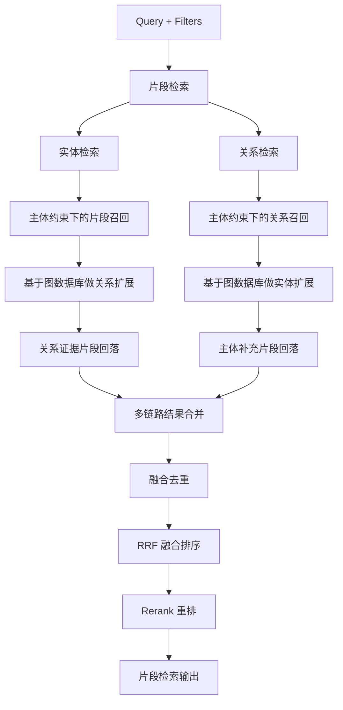
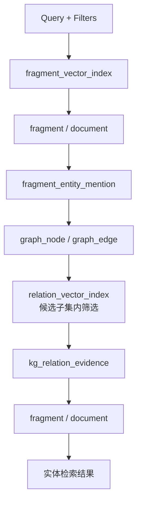
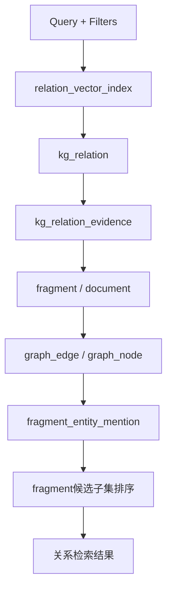

# A股股票分析 Agent 技术文档（MVP 重构版）

---

## 1. 文档说明

### 1.1 文档目的

- **项目名称**：A股股票分析 Agent
- **文档版本**：V1.0
- **文档状态**：MVP 技术文档
- **编写日期**：2026-04-11

本文档用于定义 A 股股票分析 Agent 在 MVP 阶段的技术方案，重点说明以下内容：

- MVP 阶段要解决什么问题；
- 系统由哪些核心模块组成，以及模块之间如何衔接；
- 数据如何从原始披露材料加工为可检索、可引用、可回答的对象；
- 检索与上下文构建模块在 MVP 阶段应做到什么程度；
- 哪些能力本阶段必须实现，哪些能力明确后置。

本文档不是完整投研平台设计，也不是最终的工程实现细节清单，而是 MVP 阶段的统一技术基线。

### 1.2 适用范围

本文档适用于以下团队协作场景：

- 产品与研发对齐 MVP 范围；
- 后端、数据、算法协作拆分模块职责；
- 测试根据模块输入输出设计验收用例；
- 后续版本在此基础上演进，而不是重新推翻架构。

### 1.3 MVP 核心目标

本项目 MVP 的目标不是构建完整投研平台，而是先验证以下闭环是否成立：

> 用户提问 → 识别股票主体与时间约束 → 检索官方披露与监管材料 → 组织主证据与必要背景 → 生成带引用的问答结果

MVP 阶段重点服务于**单股问答**，强调以下四点：

1. **主体正确**：回答不能串股；
2. **来源可信**：优先基于官方披露与监管文件；
3. **证据可追溯**：回答中的结论必须能回到文档与片段；
4. **输出可继续追问**：支持“依据是什么”“只看最近三个月”这类基础多轮延续。

---

## 2. 项目背景与问题定义

A 股研究并不是缺少信息，而是存在以下实际问题：

- 官方公告、财报、问询函、回复公告等分散在多个入口；
- 同一事项可能分布在多个文档中，人工需要来回跳转；
- 非结构化文本占比高，难以沉淀为可复用的知识对象；
- 高频问答场景对时效性、完整性和一致性要求高；
- 传统通用 RAG 更偏向相似文本召回，不直接适配股票问答中的主体、时间、事件、来源约束。

因此，系统不应只做“给 LLM 找几段像答案的文本”，而应围绕当前问题构建**任务上下文**：

- 先识别当前问题在问谁、问什么时间、问哪类事项；
- 再围绕主体、时间、来源、事件类型收缩候选范围；
- 再从事件、文档、片段三个层次取证；
- 最后将结果组织为面向回答生成的结构化上下文。

---

## 3. MVP 范围与非范围

### 3.1 MVP 必做范围

MVP 阶段必须支持以下能力：

1. **自然语言问答入口**
   - 能识别股票 / 公司主体；
   - 能识别时间范围；
   - 能识别基础问题类型与分析意图。

2. **核心数据接入**
   - 上市公司公告；
   - 年报、半年报、季报；
   - 业绩预告、业绩快报；
   - 交易所问询函、关注函、监管函；
   - 处罚、监管措施、公司回复公告。

3. **数据标准化与结构化**
   - 文档清洗、去噪、切分；
   - 主体识别与股票映射；
   - 事件抽取与基础分类；
   - 文档、片段、事件对象的统一组织与追溯。

4. **检索与上下文构建**
   - 单股范围内的历史检索；
   - 时间、来源、事件类型、主体过滤；
   - 主证据、历史背景、补充材料的基本分层；
   - 构建可直接交给回答生成模块的结构化上下文包。

5. **问答输出**
   - 输出简要结论；
   - 输出核心证据；
   - 区分事实与系统判断；
   - 附带来源引用。

### 3.2 MVP 明确不做

以下能力不纳入本阶段实现：

- 全市场扫描与主题跟踪；
- 完整事件簇管理；
- 完整时间线系统；
- 深度研究报告自动拼装；
- 复杂影响强度评分与估值建模；
- 股票池、订阅、推送、画像页等平台能力；
- 大规模多市场、多资产类别统一检索。

### 3.3 本阶段设计原则

为避免 MVP 过早复杂化，本阶段遵循以下原则：

1. **先做单股，再谈跨股**；
2. **先做官方披露，再谈多源融合**；
3. **先做结构化任务框架，再谈完整自适应检索闭环**；
4. **先保证可追溯与可用，再提升智能性与自动规划能力**。

---

## 4. 系统总体架构

### 4.1 系统主链路

系统主链路如下：

> 数据接入 → 数据标准化 → 主体识别 → 事件抽取 → 任务理解 → 检索与上下文构建 → 回答生成 → 引用输出

- ### 3.1 数据接入与采集

  **模块目标**  
  将核心官方信息源的数据采集到系统，保证信息完整、可追溯，并为后续数据清洗、标准化、主体识别和事件抽取提供原始数据基础。

  ---

  #### 3.1.1 采集手段

  系统采用以下方式抓取数据：

  1. **API 接入**  
     - 对于交易所和官方披露平台提供的接口，优先通过官方 API 获取结构化公告数据。
     - 优点：结构化好、稳定性高、抓取效率高。

  2. **网页爬虫（Web Scraping）**  
     - 对于没有 API 或接口受限的公告网页，采用爬虫抓取 HTML 页面。
     - 使用解析库提取正文、标题、发布时间、附件链接等关键信息。
     - 包括模拟分页抓取、翻页抓取、动态内容解析（如 JavaScript 渲染页面）。

  3. **文件下载与解析**  
     - 对 PDF、Excel 或 Word 附件进行下载。
     - OCR / PDF 解析转换为可处理的文本。
     - 对表格数据做结构化处理，便于后续关键字段提取。

  4. **增量抓取与去重**  
     - 对已抓取文档进行哈希或唯一 ID 对比，避免重复抓取。
     - 对更新或修订的公告，保存为新版本并记录版本关系。

  ---

  #### 3.1.2 采集数据源

  MVP 阶段的数据源主要包括：

  1. **交易所官方网站**
     - 上海证券交易所（SSE）：http://www.sse.com.cn  
     - 深圳证券交易所（SZSE）：http://www.szse.cn  
     - 数据类型：上市公司公告、定期报告、临时公告、监管问询函件
  2. **公司官方网站**
     - 上市公司投资者关系页面（IR）：公告、年度/半年度/季度财报、业绩预告、业绩快报
  3. **第三方披露平台（可选）**
     - 巨潮资讯网：http://www.cninfo.com.cn
     - 东方财富网公告频道：http://quote.eastmoney.com/stock/  
     - 仅在官方公告抓取受限时作为备选，主要用于校验和补充

  **数据类型覆盖**：

  - 年报、半年度报告、季报  
  - 临时公告、业绩预告、业绩快报  
  - 交易所问询函、关注函、监管函  
  - 公司回复公告  
  - 处罚决定、监管措施  

  ---

  #### 3.1.3 数据源配置

  每个数据源需配置以下内容：

  | 配置项     | 描述                                       |
  | ---------- | ------------------------------------------ |
  | 数据源名称 | 如 SSE 公告、SZSE 问询函                   |
  | 接口 / URL | API 或抓取起始 URL                         |
  | 文档类型   | 年报、季报、临时公告、问询函、处罚公告等   |
  | 编码与格式 | UTF-8、GBK 或 PDF/HTML/OCR                 |
  | 抓取策略   | 定时/实时/增量抓取                         |
  | 解析规则   | 标题提取规则、正文提取规则、附件提取规则   |
  | 版本策略   | 新文档新增，修订文档新增版本并标注版本关系 |
  | 去重策略   | 根据唯一 ID 或内容哈希判断重复             |

  每个数据源配置文件可采用 YAML 或 JSON 存储，支持快速调整抓取策略和新增来源。

  ---

  #### 3.1.4 抓取规则

  1. **URL 解析规则**  
     - 静态公告页面：直接通过 DOM / XPath / CSS Selector 提取标题、正文、发布时间  
     - 分页公告列表：解析列表页获取公告链接，再抓取详情页  
     - 动态渲染页面：使用 headless 浏览器模拟渲染后抓取

  2. **文档内容解析规则**  
     - PDF / Excel：文本解析 + 表格解析 + 核心字段提取  
     - HTML：去除页眉页脚、导航、广告，保留正文  
     - OCR 文档：文字识别后做基础清洗，去除噪点

  3. **附件处理规则**  
     - 下载附件到对象存储  
     - 提取正文及关键表格  
     - 绑定原始文档 ID 和片段 ID

  4. **时间与来源解析**  
     - 发布时间字段标准化为 ISO 8601 格式  
     - 来源字段映射为统一类型（交易所公告 / 公司公告 / 监管函件）

  ---

  #### 3.1.5 定时抓取策略

  - **批量抓取**：
    - 每日或每小时抓取前一天未抓取或新增的公告  
    - 定时抓取用于更新已知公告列表及历史文档补全  

  - **增量更新**：
    - 使用公告 ID 或内容哈希判定新旧  
    - 已存在文档按版本处理  

  - **调度方式**：
    - 任务队列 + 调度器（如 Airflow / Cron）  
    - 失败重试机制，抓取异常记录日志  

  ---

  #### 3.1.6 实时抓取策略

  - 针对紧急或高优先级数据源（交易所问询函、临时公告）：  
    - 采用实时监控 API 或网页变化通知  
    - 抓取间隔可短至 1-5 分钟  
    - 触发抓取后立即解析和入库，保证数据可用性  

  - 数据流处理：
    - 实时抓取后直接进入清洗与标准化模块  
    - 支持快速生成原始记录、文档对象和片段对象  
    - 确保主检索链路可立即使用最新公告  

  ---

  #### 3.1.7 抓取策略总结

  - **定时抓取**：适用于大多数文档，保证历史完整性  
  - **实时抓取**：适用于高优先级事件或监管信息，保证快速响应  
  - **增量+版本管理**：避免重复抓取和数据混乱  
  - **统一入库标准**：原始记录、标准化文档、片段对象层级结构  

  ---

  #### 3.1.8 MVP 范围限制

  - 只接入官方披露和监管文件（公告、财报、问询函、处罚公告）  
  - 不接入投资者关系问答、媒体资讯、宏观新闻  
  - 抓取频率与数据源能力匹配，实时抓取仅针对关键监管和临时公告  

---

### 4.2 数据清洗与标准化

**功能说明**  
将原始抓取数据进行文本去噪、统一格式、标准化字段、切分文档片段，为后续主体识别、事件抽取和检索提供干净、统一的数据基础。

**输入**  

- 原始资讯记录  

**输出**  

- 标准化文档对象（Document Layer）  
- 文档片段对象（Fragment Layer）  
- 标准化元数据字段（文档类型、来源、发布时间、所属股票主体候选等）  

**处理逻辑**  

1. **文本清理**：去除页眉页脚、广告、重复段落、乱码，保留正文和关键数字/表述。  
2. **时间标准化**：统一发布时间、披露时间和抓取时间的格式。  
3. **来源标准化**：统一来源名称，映射至标准来源类型（交易所公告、财报、监管函件等）。  
4. **文档类型识别**：根据内容特征和元数据，将文档归类为财报、公告、问询函、回复公告、处罚决定等。  
5. **长文档切分**：按章节、段落、问答结构切分，并生成片段对象，绑定文档 ID 和位置索引。  

**MVP 范围**  

- 基础去噪、清理和统一元数据  
- 基本文档类型识别  
- 长文档章节和段落切分  
- 对关键数字和表述进行标注  

---

### 4.3 实体识别与股票映射

**功能说明**  
识别文档中的股票主体和关联主体，并将文本中的各种公司名称、简称和股票代码统一映射到系统内部标准主体对象。

**输入**  

- 标准化文档对象  
- 文档片段对象  
- 股票与公司基础数据（全称、简称、股票代码等）  

**输出**  

- 主体对象（Entity / Subject Layer）  
- 主标的 / 次标的标记  
- 关联子公司 / 股东 / 实控人信息  
- 行业与主题标签  

**处理逻辑**  

1. **主体识别**：使用名称匹配、正则规则及可选 NLP 实体识别，抽取文本中涉及的公司、股票和关联主体。  
2. **映射与统一**：将识别出的名称统一映射到标准主体对象，消除历史简称或别名歧义。  
3. **主次标的判断**：确定文档中哪个主体为主标的，哪些为次标的。  
4. **关联主体回挂**：将明显关联的子公司、股东、监管方回挂到主股票主体对象。  
5. **标签生成**：为主体对象生成行业标签和主题标签，用于后续检索和上下文构建。  

**MVP 范围**  

- 支持上市公司主体、历史简称、子公司、股东和实控人  
- 输出主标的/次标的标记  
- 生成基础行业标签和主题标签  
- 对高歧义名称标记待确认  

---

### 4.4 事件抽取与结构化分类

**功能说明**  
从文档片段中抽取业务事件，并进行结构化分类，用于检索、上下文补充和回答生成。

**输入**  

- 标准化文档对象  
- 文档片段对象  
- 主体识别结果  

**输出**  

- 事件对象（Event Layer），包含：
  - 事件 ID  
  - 主体 ID  
  - 事件类型（一级、二级）  
  - 时间信息  
  - 风险标签  
  - 摘要与关键字段  
  - 原文映射  

**处理逻辑**  

1. **事件识别**：根据关键词、规则、NLP 模型抽取事件描述。  
2. **事件分类**：将事件归类到一级类型（财报业绩、监管事件、风险事件、资本运作、经营事件）及二级类型。  
3. **风险标记**：优先识别高敏感风险事件，如处罚、问询、减持等，并标记高优先级。  
4. **多事件处理**：同一文档中可能存在多个事件，分别生成独立事件对象。  
5. **原文映射**：事件对象保留与原文片段和文档的映射关系，用于后续引用与检索。  

**事件类型（一级/二级事件）**

1. **财报业绩**
   \- 年报披露
   \- 半年报披露
   \- 季度报披露
   \- 业绩预告
   \- 业绩快报

2. **监管事件**
   \- 问询函
   \- 关注函
   \- 监管回复公告
   \- 处罚决定

3. **风险事件**
   \- 违规行为
   \- 诉讼仲裁
   \- 退市风险
   \- 重大合同或担保风险

4. **资本运作**
   \- 股东增减持
   \- 回购
   \- 增发
   \- 并购重组
   \- 股权质押

5. **经营事件**
   \- 产品发布
   \- 战略合作
   \- 合同签订
   \- 投产/量产
   \- 供应链导入
   \- 管理层变动

**MVP 范围**  

- 单条资讯生成单事件或多事件对象  
- 支持一级事件类型及关键高优先级事件  
- 输出事件摘要、主体关联、时间和风险标记  
- 保留原文映射关系  

### 4..5 检索与上下文构建模块

负责围绕当前问题，基于主体、时间、来源和事件类型进行检索，并将结果组织为分层上下文包。

### 4..6 回答生成模块

负责基于上下文包生成最终问答结果，区分事实与判断，并附带引用来源。

### 4.3 模块间边界

- 数据接入模块不负责业务判断；
- 主体识别模块负责“和谁有关”；
- 事件抽取模块负责“发生了什么”；
- 检索模块负责“针对当前问题应该取哪些证据”；
- 回答生成模块负责“如何表达为用户可读结果”。

---

## 5. 数据字段设计

### 5.1 设计原则

1. **关系数据库为权威主存储**  
   文档、片段、主体、关系和证据映射均以关系数据库为准。向量库只承担检索入口职责，不作为唯一事实来源。

2. **文档与事件在 MVP 阶段合并表达**  
   当前阶段采用“一个文档对应一个事件”的简化设计，因此不再单独维护独立 `event` 主表，而是将事件属性直接收敛到 `document` 中。

3. **片段层是主证据层**  
   `fragment` 是主要的语义检索对象、引用对象和回答证据对象。所有最终回答中的核心证据，都应能够回溯到具体片段。

4. **主体关系统一使用图关系模型表达**  
   不再保留旧版 `entity_relation` 表，而是统一通过 `kg_relation` 与 `kg_relation_evidence` 表达主体之间的关系及其原文证据。

5. **必须补齐片段到主体的稳定映射**  
   为支持多主体场景下的精确过滤、图构建和关系取证，系统新增 `fragment_entity_mention`，用于记录片段中出现了哪些主体以及出现方式。

6. **向量索引按对象类型拆分维护**  
   向量检索对象不再只有片段，还包括实体与关系。系统分别维护片段、实体、关系三类向量层，用于支撑多对象混合检索。

---

### 5.2 数据对象字段定义

#### 5.2.1 原始记录层（Raw Layer）

**raw_record**

| 字段                 | 类型         | 必填 | 说明                                  |
| -------------------- | ------------ | ---- | ------------------------------------- |
| `raw_id`             | BIGINT       | 是   | 原始抓取记录主键                      |
| `source_name`        | VARCHAR(128) | 是   | 来源名称，如 `SSE / SZSE / CNINFO`    |
| `original_url`       | TEXT         | 是   | 原始页面或原始文件访问链接            |
| `title_raw`          | TEXT         | 否   | 原始抓取标题，未做标准化前保留        |
| `fetch_time`         | TIMESTAMP    | 是   | 实际抓取时间                          |
| `raw_text_store_key` | TEXT         | 否   | 原始正文或 OCR 结果在对象存储中的路径 |
| `content_hash`       | VARCHAR(64)  | 否   | 原始内容哈希，用于基础去重和增量判定  |
| `created_at`         | TIMESTAMP    | 是   | 创建时间                              |
| `updated_at`         | TIMESTAMP    | 是   | 更新时间                              |

**说明**

- `raw_record` 只负责原始来源追溯，不直接参与回答生成。
- 原始抓取数据和标准化后的业务对象应分层保存，避免后续清洗逻辑污染原始来源。

---

#### 5.2.2 标准化文档层（Document Layer）

**document**

| 字段                | 类型        | 必填 | 说明                                                         |
| ------------------- | ----------- | ---- | ------------------------------------------------------------ |
| `document_id`       | BIGINT      | 是   | 标准化文档主键                                               |
| `raw_id`            | BIGINT      | 是   | 关联原始抓取记录                                             |
| `primary_entity_id` | BIGINT      | 是   | 文档主主体 ID，用于单股场景下的主体边界控制                  |
| `title`             | TEXT        | 是   | 标准化后的文档标题                                           |
| `doc_type`          | INT         | 是   | 文档类型，如 `periodic_report / temp_announcement / inquiry / reply / penalty` |
| `event_type`        | INT         | 是   | 事件类型，如 `financial / regulatory / risk / capital_market / operations` |
| `subtype`           | INT         | 是   | 二级类型，如 `annual_report / semiannual_report / quarterly_report` |
| `publish_time`      | TIMESTAMP   | 是   | 文档发布时间，作为文档层核心时间字段                         |
| `exchange`          | VARCHAR(32) | 否   | 所属交易所，如 `SSE / SZSE / BSE`                            |
| `text_store_key`    | TEXT        | 是   | 标准化全文在对象存储中的路径                                 |
| `event_summary`     | TEXT        | 否   | 面向检索和展示的文档级事件摘要                               |
| `created_at`        | TIMESTAMP   | 是   | 创建时间                                                     |
| `updated_at`        | TIMESTAMP   | 是   | 更新时间                                                     |

**说明**

- 当前阶段采用“一个文档对应一个事件”的简化设计，因此将事件属性直接吸收到 `document` 中。
- 若后续出现“一篇文档对应多个独立事件”的场景，再将 `event` 从 `document` 中独立拆出。

---

#### 5.2.3 片段层（Fragment Layer）

**fragment**

| 字段             | 类型      | 必填 | 说明                                  |
| ---------------- | --------- | ---- | ------------------------------------- |
| `fragment_id`    | BIGINT    | 是   | 片段主键                              |
| `document_id`    | BIGINT    | 是   | 所属文档                              |
| `sequence_no`    | INT       | 是   | 片段在文档中的顺序号                  |
| `char_start`     | INT       | 否   | 片段在文档全文中的起始位置            |
| `char_end`       | INT       | 否   | 片段在文档全文中的结束位置            |
| `token_count`    | INT       | 否   | 片段估算 token 数，用于上下文预算控制 |
| `text_store_key` | TEXT      | 是   | 片段正文在对象存储中的路径            |
| `created_at`     | TIMESTAMP | 是   | 创建时间                              |
| `updated_at`     | TIMESTAMP | 是   | 更新时间                              |

**说明**

- `fragment` 是主要的语义检索和引用证据对象。
- 本版直接删除 `document_block`，把定位信息下沉到 `fragment`，减少无效中间层。

---

#### 5.2.4 主体层（Entity Layer）

**entity**

| 字段               | 类型         | 必填 | 说明                                                    |
| ------------------ | ------------ | ---- | ------------------------------------------------------- |
| `entity_id`        | BIGINT       | 是   | 主体主键                                                |
| `name`             | VARCHAR(256) | 是   | 主体标准名称                                            |
| `stock_code`       | VARCHAR(32)  | 否   | 股票代码，非上市主体可为空                              |
| `exchange`         | VARCHAR(32)  | 否   | 所属交易所，非上市主体可为空                            |
| `status`           | VARCHAR(32)  | 否   | 主体状态，如 `active / suspended / delisted / inactive` |
| `alias_names_json` | JSONB        | 否   | 别名、简称、历史简称列表                                |
| `short_profile`    | TEXT         | 否   | 主体简要画像文本，用于实体级检索描述                    |
| `created_at`       | TIMESTAMP    | 是   | 创建时间                                                |
| `updated_at`       | TIMESTAMP    | 是   | 更新时间                                                |

**说明**

- `entity` 是统一主体对象。
- `alias_names_json` 继续保留，避免首版就拆出独立别名表。

---

#### 5.2.5 片段主体提及层（Fragment Entity Mention Layer）

**fragment_entity_mention**

| 字段                 | 类型      | 必填 | 说明                               |
| -------------------- | --------- | ---- | ---------------------------------- |
| `mention_id`         | BIGINT    | 是   | 主键                               |
| `fragment_id`        | BIGINT    | 是   | 所属片段                           |
| `entity_id`          | BIGINT    | 是   | 被提及主体 ID                      |
| `is_primary_context` | BOOLEAN   | 是   | 该主体是否为当前片段的主要语义对象 |
| `created_at`         | TIMESTAMP | 是   | 创建时间                           |
| `updated_at`         | TIMESTAMP | 是   | 更新时间                           |

**说明**

- 该表用于补齐“片段到主体”的稳定映射，是多主体场景、片段级过滤和 KG 构建的基础表。
- 它不直接表达实体之间的关系，只表达“这个片段提到了哪些主体”。

---

#### 5.2.6 行业标签层（Industry Layer）

**industry**

| 字段          | 类型         | 必填 | 说明           |
| ------------- | ------------ | ---- | -------------- |
| `industry_id` | BIGINT       | 是   | 行业主键       |
| `name`        | VARCHAR(128) | 是   | 标准化行业名称 |
| `created_at`  | TIMESTAMP    | 是   | 创建时间       |
| `updated_at`  | TIMESTAMP    | 是   | 更新时间       |

**说明**

- 行业标签主要服务于主体画像和背景扩展，不承担复杂本体职责。

---

#### 5.2.7 主体-行业关联层

**entity_industry_relation**

| 字段          | 类型         | 必填 | 说明       |
| ------------- | ------------ | ---- | ---------- |
| `id`          | BIGINT       | 是   | 主键       |
| `entity_id`   | BIGINT       | 是   | 关联主体   |
| `industry_id` | BIGINT       | 是   | 关联行业   |
| `confidence`  | DECIMAL(5,4) | 否   | 关联置信度 |
| `created_at`  | TIMESTAMP    | 是   | 创建时间   |
| `updated_at`  | TIMESTAMP    | 是   | 更新时间   |

**说明**

- 一个主体可映射多个行业标签。
- 本表主要服务于过滤、标签展示和主体画像增强。

---

#### 5.2.8 主题标签层（Topic Layer）

**topic**

| 字段         | 类型         | 必填 | 说明           |
| ------------ | ------------ | ---- | -------------- |
| `topic_id`   | BIGINT       | 是   | 主题主键       |
| `name`       | VARCHAR(128) | 是   | 标准化主题名称 |
| `created_at` | TIMESTAMP    | 是   | 创建时间       |
| `updated_at` | TIMESTAMP    | 是   | 更新时间       |

**说明**

- `topic` 用于表达产业主题、业务主题和概念板块等信息。

---

#### 5.2.9 主体-主题关联层

**entity_topic_relation**

| 字段         | 类型         | 必填 | 说明       |
| ------------ | ------------ | ---- | ---------- |
| `id`         | BIGINT       | 是   | 主键       |
| `entity_id`  | BIGINT       | 是   | 关联主体   |
| `topic_id`   | BIGINT       | 是   | 关联主题   |
| `confidence` | DECIMAL(5,4) | 否   | 关联置信度 |
| `created_at` | TIMESTAMP    | 是   | 创建时间   |
| `updated_at` | TIMESTAMP    | 是   | 更新时间   |

**说明**

- 一个主体可关联多个主题标签。
- 本表主要用于主题检索补充和主体背景画像。

---

#### 5.2.10 图关系层（KG Relation Layer）

**kg_relation**

| 字段             | 类型          | 必填 | 说明                                                         |
| ---------------- | ------------- | ---- | ------------------------------------------------------------ |
| `relation_id`    | BIGINT        | 是   | 图关系主键                                                   |
| `src_entity_id`  | BIGINT        | 是   | 起始主体 ID                                                  |
| `dst_entity_id`  | BIGINT        | 是   | 目标主体 ID                                                  |
| `relation_type`  | VARCHAR(32)   | 是   | 关系类型，如 `co_mention / ownership / control / cooperation / supply_chain / regulatory / litigation / other` |
| `directionality` | BOOLEAN       | 是   | 方向性，如 `directed / undirected`                           |
| `summary`        | TEXT          | 否   | 聚合后的关系摘要文本                                         |
| `keywords_json`  | JSONB         | 否   | 关系关键词列表                                               |
| `weight`         | DECIMAL(10,4) | 否   | 关系权重，可由规则分或证据强度计算                           |
| `support_count`  | INT           | 否   | 支撑该关系的证据片段数                                       |
| `publish_time`   | TIMESTAMP     | 否   | 出现该关系的公开时间                                         |
| `created_at`     | TIMESTAMP     | 是   | 创建时间                                                     |
| `updated_at`     | TIMESTAMP     | 是   | 更新时间                                                     |

**说明**

- `kg_relation` 是聚合后的关系对象，对应图中的边，但不是最终引用证据。
- 这里不再保留旧版 `entity_relation`，统一改为可检索、可回链的关系模型。

---

#### 5.2.11 图关系证据回链层（KG Relation Evidence Layer）

**kg_relation_evidence**

| 字段             | 类型         | 必填 | 说明                       |
| ---------------- | ------------ | ---- | -------------------------- |
| `id`             | BIGINT       | 是   | 主键                       |
| `relation_id`    | BIGINT       | 是   | 所属关系 ID                |
| `fragment_id`    | BIGINT       | 是   | 证据片段 ID                |
| `document_id`    | BIGINT       | 是   | 证据所属文档 ID            |
| `evidence_score` | DECIMAL(5,4) | 否   | 当前片段对该关系的支撑强度 |
| `publish_time`   | TIMESTAMP    | 否   | 证据对应发布时间           |
| `created_at`     | TIMESTAMP    | 是   | 创建时间                   |
| `updated_at`     | TIMESTAMP    | 是   | 更新时间                   |

**说明**

- 本表用于实现“关系 → 片段证据”的稳定回查。
- 命中关系对象后，最终仍应回落到 `kg_relation_evidence -> fragment`，再进入重排和引用阶段。

---

### 5.3 向量索引结构设计

#### 5.3.1 片段向量索引层（Fragment Vector Index Layer）

**fragment_vector_index**

| 字段                | 类型          | 必填 | 说明                          |
| ------------------- | ------------- | ---- | ----------------------------- |
| `record_id`         | VARCHAR(128)  | 是   | 向量记录 ID                   |
| `fragment_id`       | BIGINT        | 是   | 对应权威片段主键              |
| `document_id`       | BIGINT        | 是   | 所属文档                      |
| `primary_entity_id` | BIGINT        | 是   | 文档主主体 ID                 |
| `text`              | TEXT          | 是   | 用于 embedding 的片段检索文本 |
| `embedding`         | VECTOR / BLOB | 是   | 片段向量                      |
| `publish_time`      | TIMESTAMP     | 否   | 发布时间过滤字段              |
| `doc_type`          | VARCHAR(64)   | 否   | 文档类型过滤字段              |
| `event_type`        | VARCHAR(64)   | 否   | 事件类型过滤字段              |
| `created_at`        | TIMESTAMP     | 是   | 创建时间                      |
| `updated_at`        | TIMESTAMP     | 是   | 更新时间                      |

**说明**

- 这张表承担传统 RAG 的原文证据召回功能。
- 命中后应回查 `fragment` 权威对象获取真实证据文本。

---

#### 5.3.2 主体向量索引层（Entity Vector Index Layer）

**entity_vector_index**

| 字段           | 类型          | 必填 | 说明                                                         |
| -------------- | ------------- | ---- | ------------------------------------------------------------ |
| `record_id`    | VARCHAR(128)  | 是   | 向量记录 ID                                                  |
| `entity_id`    | BIGINT        | 是   | 对应主体主键                                                 |
| `entity_name`  | VARCHAR(256)  | 是   | 主体标准名称                                                 |
| `content_text` | TEXT          | 是   | 主体检索文本，建议由 `entity_name + alias + stock_code + short_profile + tags` 组成 |
| `embedding`    | VECTOR / BLOB | 是   | 主体向量                                                     |
| `created_at`   | TIMESTAMP     | 是   | 创建时间                                                     |
| `updated_at`   | TIMESTAMP     | 是   | 更新时间                                                     |

**说明**

- 这张表承担实体级语义入口的职责。
- 它不是最终证据层，而是回答“哪个主体与当前 query 最相关”的入口层。
- 命中主体后，可进一步扩展到 `kg_relation` 与关联 `fragment`。

---

#### 5.3.3 关系向量索引层（Relation Vector Index Layer）

**relation_vector_index**

| 字段            | 类型          | 必填 | 说明                                                         |
| --------------- | ------------- | ---- | ------------------------------------------------------------ |
| `record_id`     | VARCHAR(128)  | 是   | 向量记录 ID                                                  |
| `relation_id`   | BIGINT        | 是   | 对应关系主键                                                 |
| `src_entity_id` | BIGINT        | 是   | 起始主体 ID                                                  |
| `dst_entity_id` | BIGINT        | 是   | 目标主体 ID                                                  |
| `relation_type` | VARCHAR(32)   | 是   | 一级关系类型                                                 |
| `content_text`  | TEXT          | 是   | 关系检索文本，建议由 `keywords + src_entity_name + dst_entity_name + summary` 组成 |
| `embedding`     | VECTOR / BLOB | 是   | 关系向量                                                     |
| `publish_time`  | TIMESTAMP     | 否   | 首次出现时间                                                 |
| `created_at`    | TIMESTAMP     | 是   | 创建时间                                                     |
| `updated_at`    | TIMESTAMP     | 是   | 更新时间                                                     |

**说明**

- 这张表不是为了再存一份边，而是为了让“关系本身”能够被语义检索。
- 命中关系后，应回到 `kg_relation` 和 `kg_relation_evidence` 获取两端主体与原文证据。

---

### 5.4 图结构设计

#### 5.4.1 图节点层（Graph Node Layer）

**graph_node**

| 字段           | 类型         | 必填 | 说明                                         |
| -------------- | ------------ | ---- | -------------------------------------------- |
| `node_id`      | BIGINT       | 是   | 图节点主键                                   |
| `entity_id`    | BIGINT       | 是   | 对应主体主键，和 `entity.entity_id` 一一对应 |
| `node_name`    | VARCHAR(256) | 是   | 节点显示名称，通常与主体标准名称一致         |
| `node_summary` | TEXT         | 否   | 节点摘要文本，用于图扩展和图检索时的轻量展示 |
| `status`       | VARCHAR(32)  | 否   | 节点状态，如 `active / inactive / merged`    |
| `created_at`   | TIMESTAMP    | 是   | 创建时间                                     |
| `updated_at`   | TIMESTAMP    | 是   | 更新时间                                     |

**说明**

- `graph_node` 是主体对象在图结构中的投影层，不是新的权威业务对象。
- 在当前设计中，图节点与 `entity` 基本保持一一对应，图节点主要服务于图遍历、邻接扩展和关系组织。
- `graph_node` 不保存原文证据正文，原文证据仍应通过 `fragment` 和关系证据表回查。
- 若后续采用图数据库实现，该层可由 `entity` 表同步生成；若继续使用关系数据库模拟图结构，也可直接将其作为图节点表维护。

---

#### 5.4.2 图边层（Graph Edge Layer）

**graph_edge**

| 字段            | 类型          | 必填 | 说明                                                |
| --------------- | ------------- | ---- | --------------------------------------------------- |
| `edge_id`       | BIGINT        | 是   | 图边主键                                            |
| `relation_id`   | BIGINT        | 是   | 对应关系主键，和 `kg_relation.relation_id` 一一对应 |
| `src_node_id`   | BIGINT        | 是   | 起始图节点 ID                                       |
| `dst_node_id`   | BIGINT        | 是   | 目标图节点 ID                                       |
| `edge_summary`  | TEXT          | 否   | 图边摘要文本，用于图扩展和图检索时的轻量展示        |
| `keywords_text` | TEXT          | 否   | 关系关键词展平文本                                  |
| `weight`        | DECIMAL(10,4) | 否   | 图边权重，可由规则分、证据数量或关系强度计算        |
| `status`        | VARCHAR(32)   | 否   | 图边状态，如 `active / inactive / merged`           |
| `created_at`    | TIMESTAMP     | 是   | 创建时间                                            |
| `updated_at`    | TIMESTAMP     | 是   | 更新时间                                            |

**说明**

- `graph_edge` 是关系对象在图结构中的投影层，不是新的权威业务对象。
- 在当前设计中，图边与 `kg_relation` 基本保持一一对应，图边主要服务于图遍历、邻接扩展和多主体关系补充。
- 图边不直接保存完整原文证据列表，原文证据应通过 `kg_relation_evidence` 回查到具体 `fragment`。
- 若后续采用图数据库实现，该层可由 `kg_relation` 表同步生成；若继续使用关系数据库模拟图结构，也可直接将其作为图边表维护。

---

#### 5.4.3 图节点设计原则

1. **图节点是主体对象的投影，不是新的主体主存**  
   节点的核心身份仍然来自 `entity.entity_id`，图节点不应脱离主体主表独立存在。

2. **图节点只保存图查询所需的轻量属性**  
   如名称、摘要、统计信息、首末出现时间等；不保存完整原文正文，不承担证据主存职责。

3. **图节点应支持邻接扩展和多主体补充**  
   当 query 命中某个主体后，可基于图节点进一步扩展其相邻主体，再回到关系证据和片段证据层完成取证。

#### 5.4.5 图边设计原则

1. **图边是关系对象的投影，不是新的关系主存**  
   边的核心身份仍然来自 `kg_relation.relation_id`，图边不应成为唯一关系事实来源。

2. **图边负责表达结构连接，不直接承担证据存储**  
   图边解决的是“谁和谁有关”，而不是“最终引用哪段原文”。

3. **图边必须能够稳定回落到证据片段**  
   任意命中的图边，都应能够通过 `relation_id -> kg_relation_evidence -> fragment` 回查到真实原文证据。

4. **图边应支持关系级扩展检索**  
   当 query 更偏关系、机制或主题时，可优先命中关系索引，再通过图边拿到两端主体和邻接结构，最后回落到片段证据层。

---

#### 5.4.6 图层与主存层关系图（文本块）

```text
entity
   └─ graph_node

kg_relation
   └─ graph_edge

graph_edge
   ├─ src_node_id -> graph_node
   └─ dst_node_id -> graph_node

kg_relation
   └─ kg_relation_evidence
        └─ fragment
```

---

### 5.4 简单数据关系图（文本块）

```text
raw_record
   └─ document
        └─ fragment
             ├─ fragment_entity_mention -> entity
             └─ 作为最终引用证据对象

entity
   ├─ entity_industry_relation -> industry
   ├─ entity_topic_relation -> topic
   └─ kg_relation -> entity
        └─ kg_relation_evidence -> fragment

fragment / entity / kg_relation
   └─ 同步到向量索引副本
       ├─ fragment_vector_index
       ├─ entity_vector_index
       └─ relation_vector_index
```

**解释**：

- raw_record：保留原始来源，方便追溯和重处理
- document：系统内部“一篇文档 + 一个事件”的统一对象
- fragment：检索和引用的主要证据片段
- entity：统一主体对象
- fragment_entity_mention：片段到主体的稳定映射层
- kg_relation：主体之间的关系对象，用于图扩展和关系级召回
- kg_relation_evidence：关系回落到原文片段的桥接层
- fragment_vector_index / entity_vector_index / relation_vector_index：三类独立向量入口，不是权威主存

---

## 6. 检索与上下文构建模块设计

### 6.1 模块目标

检索与上下文构建模块的目标，不是简单返回若干“与问题相似的文本”，而是围绕当前问题，在股票主体、时间范围、文档类型等结构化约束下，筛选出最相关、最可信、最可追溯的证据片段，并组织为可供回答生成模块直接使用的任务上下文。

A 股问答场景天然具有较强的时间效应、主体约束和材料类型差异。相同主体在不同时间窗口下可能对应完全不同的结论；相同事件在财报、临时公告、问询函、回复公告中的表达方式也可能存在明显差异。因此，本模块不能仅依赖向量相似度做泛召回，而必须坚持“先结构化约束、再检索召回、最后证据组织”的整体思路。

MVP 阶段，本模块需要完成以下目标：

1. **围绕结构化任务框架执行检索**
   - 检索入口不是原始自然语言问题，而是由任务理解模块输出的结构化任务框架；
   - 任务框架中至少应包含主体、时间范围、问题语义、文档范围等核心信息；
   - 所有首轮检索都必须在这些约束条件下执行，而不是在全量语料上直接做开放式召回。

2. **在统一约束下支持两类主检索分支**
   - **基于实体筛选的检索**：适用于主体明确、问题偏事实、偏细节、偏单点事项的查询；
   - **基于关系筛选的检索**：适用于问题偏关系、偏机制、偏影响、偏比较、偏链条结构的查询；
   - 两类分支都不是脱离约束独立执行，而是在同一主体 / 时间 / 文档类型边界内进行检索。

3. **始终以片段层作为最终证据层**
   - 无论是实体命中还是关系命中，最终都必须回落到 `fragment` 层完成证据取回；
   - 回答生成模块使用的主证据必须是可定位、可引用、可追溯的片段对象；
   - 实体与关系对象只承担检索入口和上下文组织职责，不直接替代片段证据。

4. **输出面向回答生成的结构化上下文包**
   - 本模块输出的结果不只是若干检索命中列表，而应是可直接交给回答生成模块的结构化上下文；
   - 上下文中应区分主证据、关系补充、历史背景和候选材料，并保留来源定位信息；
   - 上下文包应能够支撑“结论 + 证据 + 引用”的回答输出形式。

本模块负责：

- 接收任务理解结果与结构化任务框架；
- 基于主体、时间、文档类型等条件执行候选范围收缩；
- 选择实体筛选检索或关系筛选检索作为主分支；
- 将实体 / 关系层命中结果回落到片段证据层；
- 对片段候选进行融合、去重、重排与预算控制；
- 生成可供回答模块直接消费的结构化上下文包。

本模块本阶段不负责：

- 完整的自适应多轮检索规划；
- 面向全市场的开放式图遍历；
- 无边界的多跳关系扩散；
- 自动化研究报告级上下文编排；
- 长链路补检与不确定性控制闭环。

---

### 6.2 统一检索链路

MVP 阶段统一检索链路建议定义为：

> 用户问题 → 任务理解 → 结构化任务框架 → 基础约束过滤 → 检索模式判定 →  
> 基于实体筛选的检索 / 基于关系筛选的检索 → 片段证据回落 → 候选融合与重排 → 背景补充 → 上下文包输出

这一链路强调两个原则：

第一，**任何检索都必须先经过结构化约束收缩**。  
A 股材料天然具有时间效应和主体边界效应，因此首轮检索不能直接在全量 `fragment`、`entity` 或 `relation` 索引上裸查，而必须先结合以下条件进行约束：

- 股票主体约束；
- 时间范围约束；
- 文档类型约束；
- 业务类型约束；
- 统一二级类型约束（如有）；
- 其他必要的来源或范围限制。

第二，**主检索分支按检索目标划分，而不是按对象层级划分**。  
在当前数据设计下，事件层已不再作为独立主检索层；文档层主要承担来源与过滤职责；真正的检索主入口应围绕“先锁定相关实体”或“先锁定相关关系”展开。因此，首轮检索主分支调整为以下两类：

#### 6.2.1 基于实体筛选的检索

该分支适用于以下问题：

- 问题主体明确；
- 问题偏事实、偏细节、偏单点事项；
- 用户更关心“这个主体最近发生了什么”或“这个主体与某对象是否存在直接事项”。

典型特点包括：

- query 中存在明确股票主体；
- query 的核心目标是获取具体事项、具体披露、具体结论；
- 需要优先锁定主体边界，再从该主体相关证据片段中取证。

该分支需要先强调一个前提：

> 在 A 股场景下，股票主体不能依赖实体向量检索的 top-k 结果直接确定。  
> 主体的最终确认应在 Task Frame 生成阶段完成，由“LLM 初解析 + 程序标准化与验证”共同输出标准化主体结果。

因此，本分支中的 `entity_vector_index` 不承担“最终定主体”的职责，而只承担以下两类辅助职责：

1. 当 Task Frame 已经完成主体确认时，作为可选的主体补充入口，用于召回关联主体或做一跳邻接扩展；
2. 当 Task Frame 只解析出别名、简称、模糊称呼或主题性主体描述时，作为候选召回入口，为后续程序消歧提供候选实体集合。

在主体已经明确的前提下，本分支的首轮执行思路应调整为：

1. 先读取 Task Frame 中已经确认的主体结果，并生成首轮主体硬约束；
2. 再结合时间、文档类型、业务类型、统一二级类型等条件收缩候选范围；
3. 在收缩后的范围内，直接对 `fragment` 证据索引执行片段级双检索；
4. 如问题需要补充主体关联背景，再基于已确认主体做实体级一跳扩展；
5. 将扩展得到的主体或关联关系回落到具体证据片段；
6. 对候选片段执行融合、去重和重排；
7. 输出主证据片段与必要背景片段。

当 Task Frame 中的主体不能被程序侧唯一确认时，本分支不应直接把实体向量检索的 top-1 结果视为最终主体，而应进入“候选召回 + 消歧确认”子流程：

1. 使用 `entity_vector_index` 召回少量候选实体；
2. 结合股票代码、全称、简称、别名、交易所、主体约束等规则进行二次校验；
3. 只有在候选实体被唯一确认后，才允许生成主体硬过滤条件并进入正式检索；
4. 若候选无法唯一确认，则该分支应输出主体不确定状态，而不是直接进入首轮证据检索。

需要强调的是，实体对象不是最终回答目标。  
实体层只承担“主体确认后的检索入口”或“主体未确认时的候选补全入口”的作用，最终回答仍然必须回到具体 `fragment` 证据。

#### 6.2.2 基于关系筛选的检索

该分支适用于以下问题：

- 问题不是单点事实，而是关系、机制、影响、比较或链条结构问题；
- 用户更关心“主体之间如何连接”“某关系意味着什么”“某结构如何影响当前主体”。

典型特点包括：

- query 中虽然可能已有明确主体，但问题核心不在主体本身，而在主体之间或主体与主题之间的关系；
- query 更偏解释性、比较性、机制性；
- 需要优先锁定“哪些关系最相关”，再从关系证据中取证。

该分支的执行思路为：

1. 先根据任务框架中的主体、时间、文档类型等条件收缩候选范围；
2. 在边界范围内对关系索引执行关系级召回；
3. 对命中的关系对象补回两端主体和必要邻接信息；
4. 通过关系证据映射回落到具体片段；
5. 对候选片段进行融合、去重和重排；
6. 输出主证据片段、关系补充片段和必要背景片段。

同样需要强调的是，关系对象也不是最终回答证据。  
关系层只承担“关系入口”和“结构化上下文组织”的作用，最终回答仍应以片段原文为准。

#### 6.2.3 两类分支的统一回落原则

无论主分支是实体筛选检索还是关系筛选检索，都必须遵循统一的回落原则：

1. **回落到片段层**
   - 所有最终证据必须是 `fragment`；
   - 不允许直接以实体摘要或关系摘要替代原文证据。

2. **保留结构化约束**
   - 回落后的片段仍需满足主体、时间、文档类型等过滤条件；
   - 不允许因为图扩展而突破原始问题的边界范围。

3. **执行统一重排**
   - 来自不同分支的片段候选应进入同一套融合与重排流程；
   - 最终只输出有限数量、可解释、可引用的高质量证据片段。

#### 6.2.4 本阶段统一链路的设计意义

相比旧版“事件层 / 文档层 / 片段层并行取证”的结构，当前版本的统一检索链路更符合现有数据设计和股票问答特征，主要体现在：

1. **更符合时间效应场景**
   - 所有检索都先经过时间约束过滤，避免旧材料误入首轮结果。

2. **更符合主体边界控制**
   - 所有检索都以主体边界为先，减少串股和错误扩散。

3. **更符合多对象向量索引设计**
   - 实体索引负责主体入口；
   - 关系索引负责关系入口；
   - 片段索引负责最终证据召回。

4. **更符合最终回答的证据要求**
   - 实体和关系都只是中间入口；
   - 片段才是最终证据与引用对象。

因此，本阶段统一检索链路不是放弃原有“主体 / 时间 / 文档类型约束”的思路，而是在这些约束保持不变的前提下，将首轮主检索入口重构为“基于实体筛选的检索”和“基于关系筛选的检索”两类分支，以适配当前的数据设计与后续的混合检索实现。

### 6.3 结构化任务框架（Task Frame）

#### 6.3.1 设计目标

结构化任务框架用于把自然语言问题转换为检索模块可执行的标准输入。

其目标包括：

- 统一任务理解输出格式；
- 为不同检索器提供一致的约束条件；
- 避免检索完全依赖 prompt 临时判断；
- 为后续版本扩展为自适应检索预留接口。

#### 6.3.2 生成流程总览

Task Frame 的生成不是一次性由 LLM 直接完整产出，而是采用“LLM 初解析 + 程序确认与补全”的两阶段方式完成。  
其目标不是做复杂问题分类，而是生成能够直接驱动后续检索与上下文构建的结构化输入。

整体流程如下：

> 用户问题  
> → LLM 初步解析  
> → 主体确认  
> → 时间约束解析  
> → 关键词生成  
> → 文档范围判断  
> → 领域归类  
> → Task Frame 输出

具体说明如下：

1. **输入原始用户问题**  
   以用户原始 query 作为输入，保留原始表达，不做提前裁剪。  
   该原始问题最终写入 `user_query` 字段，作为 Task Frame 的原始任务语义来源。

2. **LLM 初步解析结构化草稿**  
   使用 LLM 对用户问题做首轮解析，初步抽取以下信息：

   - 股票主体 mention；
   - 时间表达；
   - 非主体关键词；
   - 领域线索；
   - 文档范围线索。  
     这一阶段输出的是“结构化草稿”，不是最终 Task Frame。

3. **主体确认：优先精确查找，失败时再做候选召回**  
   `subjects` 的生成采用两条确认路径：

   **第一条路径：基于 LLM 抽取股票名的直接查询确认**

   - 将 LLM 抽取出的股票名称、股票代码、简称或别名，直接到主体库中做精确查询；
   - 若能唯一命中标准主体，则直接写入 `subjects.resolved`；
   - 并补全标准化字段，如 `entity_id`、`stock_code`、`exchange`、`role` 等。

   **第二条路径：基于实体向量库的候选查找**

   - 当股票名称无法通过精确查询唯一确认时，才进入实体向量库检索；
   - 使用主体 mention 作为查询文本，在 `entity_vector_index` 中召回少量候选实体；
   - 再结合名称、别名、股票代码、交易所等规则做二次确认；
   - 若候选可唯一确认，则写入 `subjects.resolved`；
   - 若仍不能确认，则写入 `subjects.unresolved`，并保留原始 mention。

   需要强调的是：

   - `entity_vector_index` 只承担候选召回职责；
   - 不允许直接以向量 top-1 结果作为最终股票主体；
   - 股票主体的最终确认必须经过程序侧校验。

4. **生成标准化 subjects 结构**
   在主体确认完成后，程序统一生成 `subjects` 字段，包括：

   - `resolved`：已确认主体列表；
   - `unresolved`：未确认主体列表；
   - `primary_entity_ids`：主检索主体 ID 列表。  

   其中，`resolved` 内部对象应保留 `role` 字段，用于标记主主体、次主体或比较主体。

5. **时间约束解析与标准化**
   对 query 中的时间表达进行识别和标准化，生成 `time_constraint`：

   - 若用户给出明确时间范围，则直接转为结构化时间窗；
   - 若用户未给出明确时间范围，则保持为空，由后续检索模块按 `domain_facet` 或检索分支补默认时间窗；
   - 时间约束不在本阶段做复杂推理，只做标准化表达。

6. **关键词生成：去掉已提取主体后的剩余关键词**
   `keyword_terms` 不应简单从原始 query 中直接抽取，而应在主体确认之后再生成。  
   具体做法为：

   - 先从原始 query 中移除已识别并已确认的主体词；
   - 再对剩余文本提取关键词；
   - 保留与事项、关系、机制、主题、动作相关的词项；
   - 去除无意义停用词和明显冗余表达。

   这样处理的目的是：

   - 避免实体词同时进入 `subjects` 和 `keyword_terms`；
   - 降低后续检索中主体链路和关键词链路的重复召回；
   - 让 `keyword_terms` 更聚焦于“问什么”，而不是“问谁”。

   例如：

   - 原始问题：`英伟达和寒武纪谁更接近 AI 芯片主题`
   - 主体确认后：`英伟达`、`寒武纪` 进入 `subjects`
   - `keyword_terms` 中保留：`AI 芯片`、`主题`

7. **文档范围判断**
   根据问题表达判断当前问题更适合：

   - 片段级证据优先；
   - 文档级概览优先；
   - 或两者都允许参与。  

   该结果写入 `document_scope`，用于后续确定首轮检索更偏向 fragment 还是需要整文参与。

8. **领域归类**
   根据 query 的事项表达、关键词和问题意图，生成 `domain_facet`。  
   该字段用于后续映射：

   - 文档类型范围；
   - 业务类型范围；
   - 默认时间窗策略；
   - 首轮检索边界。

   `domain_facet` 的重点不是做复杂语义分类，而是为后续检索提供稳定的文档类别约束。

9. **输出最终 Task Frame**
   在以上步骤全部完成后，生成最终 Task Frame。  
   当前版本建议输出以下字段：

   - `user_query`
   - `subjects`
   - `time_constraint`
   - `keyword_terms`
   - `domain_facet`
   - `document_scope`

该流程的关键原则如下：

1. **主体确认优先于关键词生成**  
   先确认“问谁”，再生成“问什么”的关键词。

2. **主体确认优先使用精确查询**  
   实体向量库只用于候选查找，不直接决定股票主体。

3. **关键词生成必须去掉已确认主体词**  
   避免主体链路与关键词链路重复承担相同职责。

4. **Task Frame 只保留检索真正需要的字段**  
   不引入复杂问题分类字段，不引入对检索没有直接帮助的冗余标签。

5. **Task Frame 的目标是服务检索执行，而不是服务问题解释**
   其核心价值在于为后续“结构化约束收缩 + 双检索 + 证据回落”提供稳定输入。

#### 6.3.2 字段设计

MVP 阶段建议结构化任务框架至少包含以下字段：

| 字段名            | 类型   | 是否必填 | 说明                                                         |
| ----------------- | ------ | -------- | ------------------------------------------------------------ |
| `user_query`      | string | 是       | 用户原始问题                                                 |
| `subjects`        | object | 是       | 当前问题的目标股票 / 公司主体                                |
| `time_constraint` | object | 否       | 当前问题的时间范围；未显式给出时可使用默认时间窗             |
| `keyword_terms`   | object | 否       | 为片段级关键词检索提供的关键词结果                           |
| `domain_facet`    | enum   | 是       | 业务领域，表示当前问题主要落在哪类事项                       |
| `document_scope`  | object | 否       | 当前问题是否需要将整篇文档作为首轮分析对象，以及采用何种文档使用方式 |

#### 6.3.3 关键字段说明

##### 1. `subjects`

字段说明：

- `resolved`：已成功映射到系统内部实体库的股票主体列表;
- `unresolved`：LLM 识别到但程序未能可靠映射的主体列表;
- `primary_entity_ids`：程序确认后的主检索目标主体集合。
- `second_entity_ids`：程序确认后的次检索目标主体集合。

建议股票实体至少包含：

- `entity_id`：股票 / 公司主体的内部唯一标识
- `entity_name`：股票 / 公司主体名称
- `stock_code`：股票代码
- `role`：是否为当前问题的主标的  
  - `primary`：主体
  - `secondary`：次主体
  - `parallel_primay`：并列主主体
  - `uncertain`：主次关系不确定
- `confidence`：主体识别结果的置信度，用于衡量当前主体解析是否可靠

结构示意:

```text
{
  "subjects": {
    "resolved": [
      {
        "entity_id": 1001,
        "entity_name": "宁德时代新能源科技股份有限公司",
        "stock_code": "300750",
        "exchange": "SZSE",
        "mention_text": "宁德时代",
        "role": "primary",
        "resolution_confidence": 0.98,
      }
    ],
    "unresolved": [],
    "primary_entity_ids": [1001]
    "second_entity_ids": []
  }
}
```

作用：

- 为检索提供主体硬约束；
- 降低串股风险；
- 支持多轮问答时复用主标的。

##### 2. `time_constraint`

建议至少包含：

- `raw_text`：用户原始时间表达，如“最近三个月”“上次财报后”。
- `start_date`：标准化后的时间范围起始日期。
- `end_date`：标准化后的时间范围结束日期。
- `mode`：时间约束模式，如固定区间、相对时间或继承上文。
  - `relative_range`：相对时间区间，如“最近三个月”“近半年”；
  - `absolute_range`：固定时间区间，如“2025 年上半年”；
  - `point_in_time`：时间点表达，如“最新”“当前”；
  - `relative_anchor`：相对锚点表达，如“上次财报后”；
  - `none`：未提时间，由系统补默认时间窗。
- `is_default`：是否为系统补齐的默认时间范围，而非用户显式指定。
- `is_explicit`：是否为用户显式给出的时间约束

作用：

- 将“最近一个月”“最近三个月”“上次财报后”等表达标准化；
- 让检索结果与时间要求对齐；
- 明确是否由系统填充默认时间窗。


##### 3. `keyword_terms`

这里的“关键词”不是泛指用户问题中的高频词，而是指：

- 对当前问题有明确检索约束作用的专业术语；
- 表示事件或动作的核心动词；
- 能显著提升稀疏检索定位能力的短语表达；
- 需要参与同义词、别名或缩写扩展的领域词。

因此，MVP 阶段推荐方案为：

- **LLM 负责语义初判**：识别哪些术语、动作和短语值得进入关键词候选集合；
- **程序侧 NLP 负责最终提取与清洗**：完成分词、词性识别、停用词过滤、术语保留、短语归并和结构化输出；
- **程序侧规则负责标准化与约束**：控制词数上限、去重逻辑、领域词扩展和最终 Token 列表生成。


字段设计：

* `core_terms`：经过规则确认后的核心检索词
* `action_terms`：表示事件动作的核心动词
* `excluded_terms`：已识别但被排除的词，如主体词、时间词、泛词
* `confidence`：当前关键词提取结果的可信度


其后续用途是：

1. 提供给首轮检索计划生成模块，判断是否应启用关键词检索或混合检索；
2. 提供给关键词 Query Compiler，生成 BM25 / 倒排索引查询表达式；
3. 在 `filters` 已完成候选范围收口后，用于片段级精确术语定位。

##### 4. `domain_facet`

MVP 阶段建议统一为以下枚举：

- `REGULATORY`：监管
- `FINANCIAL_REPORT`：财务报告
- `OPERATIONS`：运营 -- 产品进展、客户合作、订单、产能
- `RISK_GOVERNANCE`：风险治理 -- 违规行为、诉讼仲裁、退市风险、担保风险
- `CAPITAL_MARKET`：资本运作 -- 股东增减持、回购、增发、并购重组
- `GENERAL`：通用 -- 还无法明确落到某一个领域，或者同时跨多个领域

说明：

- `domain_facet` 回答的是“这道题主要落在哪类业务事项”；
- 它与 `query_mode` 正交。

例如：

- “最近有没有监管问询”是 `LIST × REGULATORY`；
- “这次问询影响如何”是 `ASSESS × REGULATORY`；
- “最新财报有哪些重点”是 `SUMMARIZE × FINANCIAL_REPORT`。

##### 5. `document_scope`

字段说明:

- `need_full_document`：是否需要将整篇 document 纳入首轮分析范围，而不仅仅依赖 fragment；
- `mode`：文档使用模式，用于区分当前问题是只需片段分析，还是需要整篇文档，或需要两者结合；
  - `fragment_only`：默认模式，仅基于片段进行分析；
  - `full_document`：需要整篇文档参与分析；
  - `reason`：对当前文档范围判断的简要解释，用于调试、回放和后续规则校验；
- `confidence`：LLM 对该字段判断的置信度，用于衡量当前文档范围识别是否可靠

作用:

- 区分“局部事实提取”与“整篇文档概括”两类问题；
- 为首轮检索计划生成模块提供文档使用方式约束；
- 避免所有问题都默认进入整篇 document 分析，导致上下文过重；
- 为后续`retrieval_target`和`branch_plan`的生成提供上游语义依据。

#### 6.3.4 结构化任务框架示例

```json
{
  "user_query": "宁德时代最近三个月有没有在HVDC方面进行相关研发？",
  "subjects": {
    "resolved": [
      {
        "entity_id": 1001,
        "entity_name": "宁德时代新能源科技股份有限公司",
        "stock_code": "300750",
        "exchange": "SZSE",
        "mention_text": "宁德时代",
        "role": "primary",
        "resolution_confidence": 0.98,
      }
    ],
    "unresolved": [],
    "primary_entity_ids": [1001],
    "second_entity_ids": []
  },
  "time_constraint": {
    "raw_text": "最近三个月",
    "mode": "relative_range",
    "start_date": "2025-12-31",
    "end_date": "2026-03-31",
    "is_explicit": true,
    "is_default": false,
    "confidence": 0.95
  },
  "keyword_terms": {
    "core_terms": ["HVDC"],
    "action_terms": ["研发"],
    "excluded_terms": ["宁德时代"],
    "confidence": 0.93
  },
  "document_scope": {
    "need_full_document": false,
    "mode": "fragment_only",
    "reason": "用户问题是在时间窗口内列举是否存在监管问询或处罚，目标是事件扫描与事实确认，不要求对某一份监管文档整体内容进行概括",
    "confidence": 0.95
  },
  "domain_facet": {
    "primary": "REGULATORY",
    "secondary": ["RISK_GOVERNANCE"],
    "confidence": 0.91,
    "validated_by_rule": true
  }
}
```

#### 6.3.5 Task Frame 在 MVP 中的作用

本阶段，Task Frame 主要用于三件事：

1. **统一检索入口**
   - 让后续检索器不必直接处理原始自然语言问题。

2. **统一过滤条件**
   - 让主体、时间、来源、事件类型等条件以结构化方式传递。

3. **统一问题分类**
   - 让检索链路至少能区分：列举类、查找类、摘要类、解释类、判断类问题。

围绕“任务约束下的自适应检索”，以下内容明确留到后续版本：

- 基于 Task Frame 的动态检索计划生成；
- 证据槽位建模；
- 覆盖度评估与补检策略；
- 多路召回后的自动重规划；
- 显式不确定性控制与结论强弱门控。

本阶段先保证：

> 自然语言问题能够稳定落到统一的结构化任务框架上。

---

### 6.4 首轮过滤条件（Filters）

#### 6.4.1 设计目标

`filters` 用于把 Task Frame 中已经确定的主体、时间、业务领域和文档范围约束，转换为首轮检索阶段可直接执行的统一过滤条件。

其目标包括：

- 将 Task Frame 中的结构化约束编译为首轮检索统一过滤条件；
- 为事件层、文档层和片段层提供一致的候选范围收口基础；
- 避免首轮检索直接在全量索引上做无约束召回；
- 为后续 `branch_plan` 的生成提供明确的过滤边界。

`filters` 不负责：

- 决定首轮检索分支；
- 生成具体 query 文本；
- 生成排序分数；
- 进行覆盖度评估和补检规划。

因此，`filters` 的定位不是检索策略本身，而是：

> 在 Task Frame 已完成问题理解的基础上，将结构化约束编译为首轮统一过滤条件。

#### 6.4.2 字段设计

MVP 阶段建议 `filters` 至少包含以下字段：

| 字段名                      | 类型          | 是否必填 | 说明                                             |
| --------------------------- | ------------- | -------- | ------------------------------------------------ |
| `primary_entity_ids`        | array<int>    | 是       | 首轮检索的主主体硬过滤条件                       |
| `secondary_entity_ids`      | array<int>    | 否       | 次级主体 ID 列表，用于双实体或比较问题的辅助约束 |
| `time_range`                | object        | 是       | 首轮检索统一时间范围                             |
| `doc_types`                 | array<string> | 否       | 首轮允许的文档类型                               |
| `event_types`               | array<string> | 否       | 首轮允许的事件类型                               |
| `enable_relation_retrieval` | boolean       | 是       | 是否启动关系检索链路                             |
| `query_text`                | TEXT          | 是       | 标准化后的首轮查询文本                           |
| `keyword_query`             | TEXT          | 否       | 关键词查询文本                                   |

#### 6.4.3 关键字段说明

##### 1. `primary_entity_ids`

字段说明：

表示首轮检索的主主体过滤条件。

其值直接来源于 `Task Frame.subjects.primary_entity_ids`。

作用：

- 将首轮检索范围限制在当前问题的主股票 / 公司主体上；
- 降低串股和主体漂移风险；
- 为事件层、文档层和片段层提供统一主体硬约束。

规则：

- 若 `primary_entity_ids` 为空，则首轮检索计划不应继续生成；
- MVP 阶段默认不因主体缺失而自动放宽为全市场搜索。

##### 3. `secondary_entity_ids`

该字段表示双实体、比较型问题或补充型问题中的次级主体范围。

其来源为 `Task Frame.subjects.resolved` 中 `role` 为次主体、比较主体或辅助主体的实体对象。  
在单主体问题中，该字段通常为空。

该字段主要用于：

- 关系检索阶段的辅助主体约束；
- 多主体问题中的次级边界控制；
- 关系证据回落后的结果筛选。

##### 3. `time_range`

字段说明：

表示首轮检索统一使用的时间范围。

其值优先来源于 `Task Frame.time_constraint` 的标准化结果。

建议至少包含：

- `start_date`
- `end_date`

作用：

- 对首轮候选范围进行时间收口；
- 保证事件、文档和片段结果与问题时间约束一致；
- 避免首轮检索因时间未收口而引入大量历史噪声。

规则：

1. 若 `Task Frame.time_constraint` 已给出显式范围，则直接使用；
2. 若用户未显式指定时间范围，则系统按 `domain_facet` 补默认时间窗；
3. 默认时间窗应由程序规则生成，而不由 LLM 临时决定。

建议默认时间窗如下：

| `domain_facet`     | 默认时间窗  |
| ------------------ | ----------- |
| `REGULATORY`       | 最近 180 天 |
| `RISK_GOVERNANCE`  | 最近 180 天 |
| `CAPITAL_MARKET`   | 最近 180 天 |
| `FINANCIAL_REPORT` | 最近 400 天 |
| `OPERATIONS`       | 最近 180 天 |
| `GENERAL`          | 最近 180 天 |

说明：

- 财报类问题需要覆盖最近一期定期报告、业绩预告、业绩快报，因此默认时间窗可以更长；
- 监管、风险、资本运作和经营事件问题，默认半年窗口通常足以满足 MVP 首轮检索。

##### 4. `doc_types`

字段说明：

表示首轮允许的文档类型范围。

建议枚举沿用文档层设计中的 `doc_type`：

- `periodic_report`
- `temp_announcement`
- `inquiry`
- `reply`
- `penalty`

作用：

- 在首轮检索中进一步缩小文档和片段候选范围；
- 将业务领域约束落实到文档级过滤；
- 避免不同领域的公告类型互相污染。

建议映射规则如下：

| `domain_facet`     | `doc_types`                                          |
| ------------------ | ---------------------------------------------------- |
| `REGULATORY`       | [`inquiry`, `reply`, `penalty`, `temp_announcement`] |
| `RISK_GOVERNANCE`  | [`penalty`, `temp_announcement`, `reply`, `inquiry`] |
| `CAPITAL_MARKET`   | [`temp_announcement`, `periodic_report`]             |
| `FINANCIAL_REPORT` | [`periodic_report`, `temp_announcement`]             |
| `OPERATIONS`       | [`temp_announcement`, `periodic_report`]             |
| `GENERAL`          | []                                                   |

说明：

- `GENERAL` 不建议做文档类型硬限制；
- `REGULATORY` 和 `RISK_GOVERNANCE` 需要允许问询、回复、处罚及相关临时公告；
- `CAPITAL_MARKET` 和 `OPERATIONS` 很多事件以临时公告为主，但也可能出现在定期报告中。

##### 5. `event_types`

字段说明：

表示首轮事件层收口时允许的事件类型范围。

建议枚举沿用事件层设计中的一级类型：

- `financial`
- `regulatory`
- `risk`
- `capital_market`
- `operations`

作用：

- 约束事件层只收回当前业务领域相关的事件；
- 为非 `GENERAL` 问题提供首轮事件收口条件；
- 控制事件层返回的候选文档和片段映射范围。

建议映射规则如下：

| `domain_facet`     | `event_types`          |
| ------------------ | ---------------------- |
| `REGULATORY`       | [`regulatory`, `risk`] |
| `RISK_GOVERNANCE`  | [`risk`, `regulatory`] |
| `CAPITAL_MARKET`   | [`capital_market`]     |
| `FINANCIAL_REPORT` | [`financial`]          |
| `OPERATIONS`       | [`operations`]         |
| `GENERAL`          | []                     |

说明：

- `REGULATORY` 和 `RISK_GOVERNANCE` 在实际数据中可能存在交叉，因此建议允许双向覆盖；
- `GENERAL` 不通过事件层做首轮硬收口，因此 `event_types` 可为空。

##### 6. `enable_relation_retrieval`

该字段表示当前问题是否需要启动关系检索链路。

该字段的取值建议由以下条件共同决定：

- 是否存在两个及以上已确认主体；
- 当前问题是否明显包含关系、比较、关联、依赖、合作、竞争等表达；
- 当前 `domain_facet` 是否更适合通过关系链路补充证据。

##### 7. `query_text`

该字段表示供首轮检索直接使用的标准化查询文本。

其来源通常为原始 `user_query` 的保留或轻量标准化结果。  
例如可做以下处理：

- 去除多余空白和无意义符号；
- 保留原始问题主语义；
- 不做过度改写。

该字段的作用是：

- 作为首轮语义检索的统一查询输入；
- 避免后续模块再回读原始 Task Frame 中的 `user_query`。

##### 8. `keyword_query`

该字段表示供关键词链路和关系链路使用的查询文本。

该字段不能直接等于原始 query，而应在主体确认之后生成。  
其构造原则为：

1. 先识别并确认 `subjects`；
2. 从原始 query 中移除已确认主体词；
3. 对剩余文本提取关键词；
4. 保留事项词、主题词、关系词、动作词、机制词；
5. 去除停用词和无效冗余表达。

#### 6.4.4 生成规则

MVP 阶段，`filters` 建议采用**程序规则生成**。

生成顺序如下：

##### 1. 生成 `primary_entity_ids`

直接取自 `Task Frame.subjects.primary_entity_ids`。

##### 2. 生成 `time_range`

优先使用 `Task Frame.time_constraint`；  
若未显式给出，则按 `domain_facet` 补默认时间窗。

##### 4. 生成 `doc_types`

根据 `Task Frame.domain_facet` 进行映射。

##### 5. 生成 `event_types`

根据 `Task Frame.domain_facet` 进行映射；  
若 `domain_facet = GENERAL`，则置为空。

##### 6. 关系链路开关生成

- 若当前问题中存在两个及以上已确认主体，或问题明显包含关系型表达，则置 `enable_relation_retrieval = true`；
- 否则置为 `false`。

#### 6.4.5 示例

```json
{
  "filters": {
    "primary_entity_ids": [1001],
    "second_entity_ids": [],
    "time_range": {
      "start_date": "2025-12-31",
      "end_date": "2026-03-31"
    },
    "doc_types": ["inquiry", "reply", "penalty", "temp_announcement"],
    "event_types": ["regulatory", "risk"],
    "enable_relation_retrieval": false
  }
}
```

### 6.5 检索执行策略

检索执行策略负责在 Task Frame 和结构化 filters 已经生成的前提下，完成第一批候选证据的召回、补充、融合与排序。

本阶段不做多轮自适应扩展，不做无边界图遍历，不直接生成回答，而是在明确主体、时间范围、文档类型和事件类型约束下，完成一次受控首轮检索，并输出可直接进入上下文构建阶段的候选结果集合。

首轮检索在执行层面分为两类：

1. **文档检索**
2. **片段检索**

其中，片段检索再进一步分为：

- **实体检索**
- **关系检索**

这样划分的原因是：

- 有些问题首先需要定位相关文档，再由后续阶段决定是否进一步下钻到片段；
- 有些问题本身就是证据型问题，应直接进入片段层召回；
- 片段层才是最终证据层，因此实体检索和关系检索都必须最终回落到 `fragment`。

本阶段的执行约束统一来自 `filters`。检索的所有路径，都必须在这些约束范围内执行。

---

#### 6.5.1 文档检索

文档检索用于直接确定“当前问题对应哪些文档对象”。该路径不是语义召回路径，而是结构化筛选路径。

在当前系统中，Task Frame 和 filters 已经给出了足够明确的结构化约束，系统可以直接根据这些约束从 `document` 主存中确定候选文档集合。

文档检索的执行方式如下：

1. 读取 `filters` 中的结构化约束；
2. 以 `primary_entity_id` 作为主体边界；
3. 以 `publish_time` 作为时间边界；
4. 以 `doc_type` 和 `event_type` 作为文档类型边界；
5. 直接在 `document` 表中筛选满足条件的文档集合。

文档检索的本质是“命中过滤”，而不是“相似度召回”。例如“总结最近的财报”这类问题，系统可以直接依据主体、时间范围和财报类型，从 `document` 表中取出对应文档，而不需要额外做 top-k 检索。

文档检索的结果主要用于两类场景：

1. 当前问题本身就是文档集合型问题，例如某一时间窗口内有哪些财报、问询函、业绩预告；
2. 当前问题最终仍需片段证据，但应先由文档检索确定文档范围，再在这些文档内部继续执行片段检索。

因此，文档检索在首轮执行中的作用是：**先通过结构化约束确定文档边界，再决定是否进入片段层做进一步取证。**

---

#### 6.5.2 片段检索

片段检索用于直接召回可引用、可定位、可追溯的证据片段。片段层是首轮检索的核心执行层，也是后续回答生成所依赖的最终证据来源。

片段检索在执行上分为两条路径：

1. **实体检索**
2. **关系检索**

两条路径可以单独执行，也可以并行执行。若并行执行，则在各自路径内部先形成局部候选集合，再进入统一的融合、去重和排序阶段，总体流程：



---

#### 6.5.3 实体检索

实体检索适用于问题已经明确落在主体自身事项、单点事实、公告结论、阶段状态变化等场景。

在当前系统中，实体检索不再以 `entity_vector_index` 作为首轮主入口。原因是主体已经在 Task Frame 和 filters 生成阶段完成识别与确定，执行阶段不需要再次做主体识别，而是应直接在主体约束下检索与该主体最相关的片段证据。

实体检索的执行流程如下：



---

##### 1. 主体约束下的片段主召回

系统首先在 `fragment_vector_index` 上执行受约束的 top-k 检索。此时，`primary_entity_id`、时间范围、文档类型和事件类型共同构成片段召回边界。

该阶段的目标是先找到“在当前主体正确、时间正确、材料类型正确的前提下，与当前 query 最相关的一批片段”。这些片段构成实体检索的主证据起点。

##### 2. 命中片段中的主体共现识别

系统以首批命中片段为基础，查询 `fragment_entity_mention`，识别这些高分片段中实际出现的主体集合。

该阶段的目标不是重新做主体召回，而是确定：

- 当前主主体之外，哪些关联主体在高分片段中高频共现；
- 哪些主体可能构成后续关系补充的候选对象。

也就是说，实体检索并不是在首批片段之后立刻回关系表，而是先通过片段层识别当前 query 已经真实命中的主体共现范围，再决定后续关系扩展的边界。

##### 3. 基于图数据库的一跳关系扩展

在识别出主体共现范围后，系统不直接在关系主表上做全量扩展，而是切换到图数据库，以当前主主体对应的图节点作为中心节点，执行一跳关系扩展。

图数据库在这一阶段承担的是**结构扩展层**职责，而不是证据层职责。其作用是：

- 从主主体出发，快速获得一跳相邻的关系边；
- 在图结构上判断哪些关系与当前主主体直接相连；
- 结合片段命中的主体共现结果，对一跳邻接边进行收缩；
- 避免在关系表上做无结构的全量关系扫描。

因此，实体检索中的图扩展不是开放式遍历，而是：

- 以主主体图节点为起点；
- 只取一跳邻接边；
- 再结合当前片段命中的共现主体做约束；
- 形成当前 query 下的局部关系候选集合。

##### 4. 关系候选子集内的相关性筛选

在通过图数据库得到一跳关系候选之后，系统再回到 `relation_vector_index`，但此时不是做全量关系检索，而是只在这批图扩展得到的候选关系子集内做相关性筛选。

这一步的作用是从“结构上相关”的关系中，进一步筛出“语义上最贴近当前 query”的少量关系，避免把所有一跳邻边都无差别回落到证据层。

##### 5. 关系证据片段回落

完成关系候选筛选后，系统通过 `kg_relation_evidence` 将这些关系对象回落到真实片段证据层，再回查 `fragment` 与 `document`，得到关系支撑片段。

至此，实体检索形成两类片段来源：

- 主体约束下直接命中的片段；
- 基于图数据库一跳扩展后回落得到的关系补充片段。

前者表达主体自身的直接证据，后者补充主体相关的一跳关系证据。

---

#### 6.5.4 关系检索

关系检索适用于问题更偏关系、影响、比较、链条、机制、关联方结构等场景。

关系检索的主入口是 `relation_vector_index`。该路径的核心思路不是先找主体再找关系，而是在主体边界已知的前提下，优先确定“当前 query 最关注的是哪条关系”，再从关系回落到证据片段，并进一步补充关系两端主体相关的片段。

关系检索的执行流程如下：



---

##### 1. 主体约束下的关系主召回

系统首先在 `relation_vector_index` 上执行受约束的 top-k 检索。这里的约束重点是保证关系仍然围绕当前主主体展开，而不是进入开放域关系搜索。

该阶段的目标是先确定“在当前主体和时间边界内，最像当前 query 所在问的那批关系”。

##### 2. 关系对象回落与主证据取回

关系主召回完成后，系统先回到 `kg_relation`，确认关系对象本身，再通过 `kg_relation_evidence` 回落到真实证据片段，最后回查 `fragment` 与 `document`。

关系检索在这里的原则是：**关系命中后，优先先取关系自己的直接证据**，而不是立即重新在全库片段上做开放式检索。这样可以保证关系路径的首轮结果具有更高的可追溯性和更低的噪声。

##### 3. 基于图数据库的关系端点扩展

在取得关系主证据之后，系统切换到图数据库，以当前命中的关系边为中心，识别该关系连接的两个主体节点。

图数据库在这一阶段承担的是**关系结构补全层**职责。其作用是：

- 明确这条关系连接的两个主体；
- 在图结构上确认它们的邻接位置；
- 为后续主体补充片段提供端点主体集合；
- 在必要时支持基于关系边的一跳轻量扩展。

这里仍然只允许一跳范围内的结构补充，不允许以关系边为中心继续做无边界多跳扩散。

##### 4. 关系两端主体的补充片段检索

在通过图数据库识别出关系两端主体之后，系统围绕这些主体执行补充片段检索。

为避免无边界扩展，该阶段不直接对全量 `fragment_vector_index` 做开放式召回，而是先通过 `fragment_entity_mention` 收缩到“确实提及这些主体的片段集合”，再在这个候选子集内叠加当前 filters，最后执行相似度排序。

这样做的目的是：

- 保证补充片段仍然与关系两端主体直接相关；
- 防止关系检索在主体补充阶段退化成一次新的全库片段检索；
- 保留关系主线，同时补足两端主体背景和局部上下文。

至此，关系检索形成两类片段来源：

- 关系自身的主证据片段；
- 关系两端主体的补充片段。

前者用于表达关系本身，后者用于补充关系双方的局部背景与上下文。

---

#### 6.5.5 候选补全、融合与去重

首轮检索允许文档检索、实体检索和关系检索并行执行。若多个路径同时执行，则各路径结果需要进入统一候选池。

在当前方案中，文档候选与片段候选分开维护；片段候选进入统一片段融合流程。

片段候选的来源主要包括：

- 实体检索中的主体主召回片段；
- 实体检索中基于图数据库一跳扩展后回落得到的关系补充片段；
- 关系检索中的关系主证据片段；
- 关系检索中基于图数据库端点扩展后得到的主体补充片段。

##### 1. 候选补全

若某一路结果数量明显不足，可执行一次受控补全。补全规则如下：

- 若实体主召回不足，可在相同主体与时间范围下适度放宽 `event_type` 约束；
- 若关系主召回不足，可在相同主体与时间范围下适度放宽关系类型限制；
- 若主体补充片段不足，可适度扩大候选主体集合或放宽 `doc_type` 约束；
- 首轮阶段只允许一次补全，不允许形成循环扩展。

##### 2. 候选融合

各路径结果进入统一候选池后，系统不再区分其是否来自实体检索或关系检索，而是统一作为首轮片段候选集合处理。但每条候选仍需保留其来源路径标记，用于后续排序解释和 trace 输出。

##### 3. 主键级去重

片段候选首先按 `fragment_id` 去重。同一片段若由多条路径命中，则合并为一条记录，并保留其多路径命中信息。

##### 4. 近重复去重

若多个候选片段来自同一 `document_id`，且 `sequence_no` 相邻、正文高度相似，则按以下规则处理：

- 优先保留综合得分更高者；
- 若两者分别承担不同证据角色，可合并为连续证据块；
- 合并后仍以片段集合形式保留原始引用位置。

去重之后，形成统一的首轮片段候选集合。

---

#### 6.5.6 RRF 融合排序

由于实体检索和关系检索的局部得分来源不同，且不同路径的分数尺度不天然可比，因此首轮统一融合阶段采用 RRF（Reciprocal Rank Fusion）进行排序。

RRF 只作用于片段候选集合，不作用于文档候选集合。

RRF 的基本思想不是比较不同路径的原始分值，而是比较同一候选在不同路径中的局部排名。这样可以降低实体路径与关系路径之间分数不可比的问题，也能更稳定地融合“主体主证据”“关系补充证据”“关系主证据”“主体补充证据”这几类来源不同的片段。

在当前实现中，可参与 RRF 的路径包括：

- `entity_main`
- `entity_relation`
- `relation_main`
- `relation_entity`

RRF 融合完成后，系统得到一份统一的首轮排序结果。该排序结果的作用是完成多路径候选的初步统一，而不是替代最终精排。

---

#### 6.5.7 Rerank 重排

RRF 排序之后，系统对前若干条片段候选执行精排，以提高最终证据排序质量。

Rerank 为可开关能力。若 rerank 后端已配置成功且当前查询允许启用精排，则系统对 RRF 排序后的高位候选执行 rerank；若 rerank 不可用、超时或失败，则直接回退到 RRF 排序结果。该实现方式与当前工程中的 rerank 集成方式一致，即 rerank 作为查询阶段可启用的独立后处理能力，不改变前置召回链路。

Rerank 的输入单位为 `[query, fragment_text]` 对。每条候选片段的重排文本由片段正文为主，再辅以文档标题、文档类型、事件类型等辅助信息构成。若该片段来自关系路径，则可附加对应关系摘要，以帮助模型理解该片段所处的关系语义。

Rerank 的目标不是增加新的候选，而是在已经完成主体约束、图扩展、关系回落和 RRF 融合之后，对现有候选进行更细粒度的相关性重排，进一步提升首轮证据排序质量。

---

#### 6.5.8 最终输出与预算控制

Rerank 结束后，系统对首轮候选结果执行最终预算裁剪。预算控制包括：

- 最终片段数上限；
- 最终 token 数上限；
- 单文档片段数上限；
- 关系补充片段占比上限；
- 历史背景类片段占比上限。

裁剪完成后，形成首轮检索输出结果。输出结果至少应保留：

1. 文档候选集合；
2. 最终片段候选集合；
3. 各片段的来源路径信息；
4. 各片段的融合排序信息与重排信息；
5. trace 信息。

至此，首轮检索执行结束。该阶段输出的是已经完成文档检索、片段检索、图数据库一跳扩展、候选补全、融合去重、RRF 排序和 Rerank 精排后的首轮候选结果集合，可直接进入后续上下文构建阶段。

#### 6.5.8 最终输出与预算控制

Rerank 结束后，系统对首轮候选结果执行最终预算裁剪。预算控制包括：

- 最终片段数上限；
- 最终 token 数上限；
- 单文档片段数上限；
- 关系补充片段占比上限；
- 历史背景类片段占比上限。

裁剪完成后，形成首轮检索输出结果。输出至少包括：

1. 文档候选集合
2. 最终片段候选集合
3. 各片段的来源路径信息
4. 各片段的融合得分与重排得分
5. Trace 信息

至此，首轮检索执行结束。该阶段输出的是已经完成文档检索、片段检索、候选补全、融合去重、RRF 排序和 Rerank 精排后的首轮候选结果集合，可直接进入后续上下文构建阶段。

---

## 8. 回答生成与引用输出

### 8.1 输出目标

回答生成模块负责将上下文包转换为用户可读结果，但必须遵守以下原则：

- 结论尽量简洁；
- 证据优先于修辞；
- 事实与系统判断分开表述；
- 每个核心结论均可回溯到文档或片段。

### 8.2 MVP 输出结构

MVP 阶段统一输出为问答式结果，建议包含：

1. 用户问题
2. 简要结论
3. 核心证据
4. 相关历史参考（可选）
5. 事实与判断区分
6. 引用来源

### 8.3 基础判断输出

MVP 阶段仅支持轻量判断：

- 利好
- 中性
- 利空
- 待观察

说明：

- 本阶段不做复杂估值和影响强度模型；
- 当证据不足时，应优先输出“待观察”而不是强结论。

---

## 9. 非功能要求

### 9.1 可信度要求

- 官方披露与监管文件优先；
- 低优先级来源不能覆盖高优先级来源；
- 回答中需体现来源。

### 9.2 可追溯性要求

- 所有核心结论必须能回到文档或片段；
- 文档、片段、事件、主体之间关系必须可追溯；
- 版本信息必须可保留。

### 9.3 可解释性要求

- 明确区分事实与系统判断；
- 对利好 / 利空 / 待观察给出基础依据；
- 避免脱离证据的泛化输出。

### 9.4 性能要求

- 常见单股问答应在可接受时间内返回；
- 检索链路应优先通过结构化过滤收缩范围，避免全量高成本检索；
- 长文档切分与索引更新应稳定可用。

### 9.5 可扩展性要求

- 后续可在 Task Frame 基础上扩展为自适应检索；
- 后续可增加更多数据源与更复杂的关系对象；
- 模块边界应保持稳定，避免 MVP 实现阻碍后续演进。

---

## 10. MVP 验收要点

### 10.1 功能验收

系统至少应稳定支持以下问题：

- 某股票最近一个月有哪些重要公告？
- 最近是否有监管问询或处罚？
- 最新财报有哪些重点？
- 最近三个月有哪些风险事件？
- 某个事件偏利好还是利空？依据是什么？

### 10.2 输出验收

回答应满足：

- 主体正确；
- 时间范围基本正确；
- 核心证据来自可信来源；
- 回答不是简单原文拼接；
- 能区分事实与系统判断；
- 能定位到引用来源。

### 10.3 检索与上下文验收

MVP 阶段至少应满足：

- 能将问题解析为统一的 Task Frame；
- 能基于 Task Frame 执行主体、时间、来源和事件类型过滤；
- 能对不同问题类型采用不同主召回路径；
- 能输出主证据、历史背景、补充材料的基本分层；
- 能将结构化上下文包传递给回答生成模块。

---

## 11. 后续演进方向

在不改变本期总体架构的前提下，后续可逐步演进：

1. 从结构化 Task Frame 进一步扩展到动态检索计划；
2. 增加证据槽位与覆盖度评估；
3. 增加补检与重规划；
4. 增加完整不确定性表达；
5. 增加相似事件、时间线与更复杂的跨文档关联能力。

本次重构版技术文档的目标，是先把 MVP 的边界、对象模型和 Task Frame 定义清楚，为后续演进打下稳定基础。